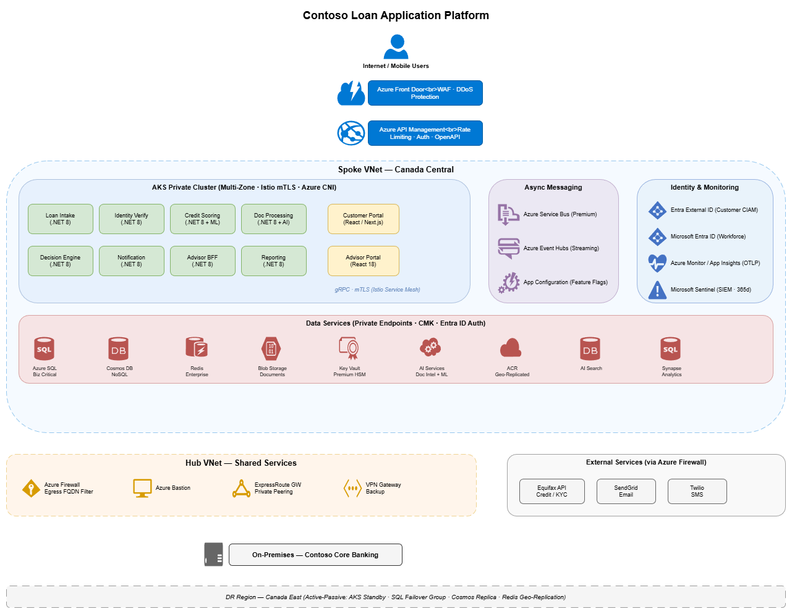

# Architecture Design: Contoso Loan Application Platform

## Requirements Summary

Contoso Financial Services requires a **digital loan application platform** enabling retail banking customers to apply for personal loans, auto loans, and mortgage pre-approvals through web and mobile channels. The platform must handle up to 10,000 concurrent users, achieve 99.95% uptime, and comply with PIPEDA, OSFI, and AML regulations. All customer data is classified as **Confidential** (PII + financial data) and must reside in Canadian Azure regions (Canada Central / Canada East).

### Key Functional Capabilities

| Capability | Description |
|---|---|
| Loan Application Intake | Self-service submission with PII, employment, and financial data |
| Identity Verification | Integration with Equifax and internal KYC |
| Credit Scoring | ML-based automated scoring with manual underwriting fallback |
| Document Processing | OCR extraction from pay stubs, tax returns, ID scans |
| Decision Engine | Rules-based + ML-assisted loan approval/decline/refer |
| Notification Service | Email (SendGrid) and SMS (Twilio) status updates |
| Advisor Portal | Internal web app for loan advisors to review referred applications |
| Reporting Dashboard | Real-time pipeline, approval rates, and SLA tracking |

### Non-Functional Targets

| Requirement | Target |
|---|---|
| Availability | 99.95% uptime |
| API Response Time | P95 < 500ms reads, P95 < 2s submissions |
| Concurrent Users | 10,000 simultaneous applicants |
| Data Retention | 7 years (regulatory) |
| Data Classification | Confidential (PII + financial data) |
| Regulatory | PIPEDA, OSFI, AML |
| Primary Region | Canada Central |
| DR | RPO ≤ 30 min, RTO ≤ 2 hours |
| Budget | ~$15K/month Azure production spend |

## Architecture Overview



The Contoso Loan Application Platform follows a **microservices architecture** deployed on **Azure Kubernetes Service (AKS)** in a **hub-spoke network topology** within Contoso's existing Azure Landing Zone. The design applies Domain-Driven Design (DDD) for service boundary identification [CTSO-APP-001 §1] and uses event-driven patterns for asynchronous processing [CTSO-APP-001 §1].

### High-Level Component Layout

```
┌─────────────────────────────────────────────────────────────────────────┐
│                        Internet / Mobile Clients                        │
└─────────────┬───────────────────────────────────────────────────────────┘
              │ HTTPS (TLS 1.3)
┌─────────────▼───────────────────────────────────────────────────────────┐
│              Azure Front Door (WAF + DDoS Protection)                   │
└─────────────┬───────────────────────────────────────────────────────────┘
              │ Private Link
┌─────────────▼───────────────────────────────────────────────────────────┐
│                     Azure API Management (APIM)                         │
│              (Rate limiting, AuthN/AuthZ, OpenAPI docs)                  │
└─────────────┬───────────────────────────────────────────────────────────┘
              │
┌─────────────▼───────────────────────────────────────────────────────────┐
│                  SPOKE VNET — Application Workloads                     │
│  ┌─────────────────────────────────────────────────────────────────┐    │
│  │              AKS Private Cluster (Multi-Zone)                   │    │
│  │  ┌──────────┐ ┌───────────┐ ┌──────────┐ ┌──────────────────┐  │    │
│  │  │  Loan    │ │ Identity  │ │  Credit  │ │    Document      │  │    │
│  │  │ Intake   │ │Verification│ │ Scoring  │ │   Processing     │  │    │
│  │  │ Service  │ │  Service  │ │ Service  │ │    Service       │  │    │
│  │  └────┬─────┘ └─────┬─────┘ └────┬─────┘ └───────┬──────────┘  │    │
│  │  ┌────▼─────┐ ┌─────▼─────┐ ┌────▼─────┐ ┌──────▼──────────┐  │    │
│  │  │ Decision │ │Notification│ │ Advisor  │ │   Reporting     │  │    │
│  │  │  Engine  │ │  Service  │ │  Portal  │ │   Service       │  │    │
│  │  │ Service  │ │           │ │ (React)  │ │                 │  │    │
│  │  └──────────┘ └───────────┘ └──────────┘ └─────────────────┘  │    │
│  │          ↕ gRPC/mTLS          ↕ Service Bus / Event Hubs       │    │
│  └─────────────────────────────────────────────────────────────────┘    │
│                                                                         │
│  ┌─────────────────────────────────────────────────────────────────┐    │
│  │                   Data Services (Private Endpoints)             │    │
│  │  ┌──────────┐ ┌──────────┐ ┌──────────┐ ┌──────────────────┐  │    │
│  │  │Azure SQL │ │Cosmos DB │ │  Redis   │ │  Blob Storage    │  │    │
│  │  │(Primary) │ │(Metadata)│ │Enterprise│ │  (Documents)     │  │    │
│  │  └──────────┘ └──────────┘ └──────────┘ └──────────────────┘  │    │
│  └─────────────────────────────────────────────────────────────────┘    │
└─────────────────────────────────────────────────────────────────────────┘
              │ VNet Peering
┌─────────────▼───────────────────────────────────────────────────────────┐
│                        HUB VNET — Shared Services                       │
│  ┌──────────┐ ┌──────────┐ ┌──────────────┐ ┌─────────────────────┐   │
│  │  Azure   │ │  Azure   │ │ ExpressRoute │ │  VPN Gateway        │   │
│  │ Firewall │ │ Bastion  │ │   Gateway    │ │   (Backup)          │   │
│  └──────────┘ └──────────┘ └──────┬───────┘ └─────────────────────┘   │
└───────────────────────────────────┼─────────────────────────────────────┘
                                    │ ExpressRoute
┌───────────────────────────────────▼─────────────────────────────────────┐
│                    On-Premises — Contoso Core Banking                   │
└─────────────────────────────────────────────────────────────────────────┘
```

### Microservices Inventory

| Service | Domain | Technology | Communication |
|---|---|---|---|
| Loan Intake Service | Application Intake | .NET 8 (C#) | REST + gRPC |
| Identity Verification Service | KYC / AML | .NET 8 (C#) | gRPC + async (Service Bus) |
| Credit Scoring Service | Underwriting | .NET 8 (C#) + Azure ML | gRPC + async (Service Bus) |
| Document Processing Service | Document Management | .NET 8 (C#) + Azure AI Document Intelligence | Async (Service Bus) |
| Decision Engine Service | Loan Decisioning | .NET 8 (C#) | gRPC + async (Service Bus) |
| Notification Service | Communications | .NET 8 (C#) | Async (Service Bus consumer) |
| Advisor Portal BFF | Advisor Experience | .NET 8 (C#) | REST |
| Advisor Portal Frontend | Advisor Experience | React 18+ | HTTPS |
| Customer Portal Frontend | Customer Experience | React 18+ / Next.js | HTTPS |
| Reporting Service | Analytics | .NET 8 (C#) | REST + Event Hubs consumer |

### Key Architecture Decisions

| # | Decision | Rationale |
|---|---|---|
| 1 | AKS as primary compute platform | Top preference per [CTSO-INFRA-001 §3]; supports private cluster, multi-zone, auto-scaling |
| 2 | .NET 8 for all backend services | Team expertise; approved per [CTSO-APP-001 §3] |
| 3 | React 18+ / Next.js for frontends | Team expertise; approved per [CTSO-APP-001 §3] |
| 4 | Azure SQL Database for primary OLTP | SQL Server preference for .NET per [CTSO-DATA-001 §1]; Confidential data with CMK |
| 5 | Entra External ID for customer CIAM | Replaces Azure AD B2C (end-of-sale May 2025); per [CTSO-IAM-001 §1] |
| 6 | Hub-spoke with Azure Firewall | Per [CTSO-NET-001 §1]; integrates with existing Landing Zone |
| 7 | Azure Front Door with WAF | Per [CTSO-NET-001 §4] and [CTSO-SEC-001 §3]; global ingress with OWASP 3.2 ruleset |
| 8 | Bicep for IaC | Preferred per [CTSO-INFRA-001 §4] |
| 9 | Event-driven async with Service Bus | Per [CTSO-APP-001 §1]; decouples services for loan processing pipeline |
| 10 | Active-Passive DR to Canada East | Per [CTSO-INFRA-001 §6]; meets RPO ≤ 30 min requirement |

### Cost Estimate (Production — Monthly)

| Component | Estimated Monthly Cost |
|---|---|
| AKS (3-5 nodes, D4s v5, multi-zone) | $3,000 – $4,000 |
| Azure SQL (Business Critical, zone-redundant) | $1,500 – $2,000 |
| Azure Cosmos DB (autoscale) | $500 – $1,000 |
| Azure Cache for Redis (Enterprise) | $1,000 – $1,500 |
| Azure Service Bus (Premium) | $700 |
| Azure Event Hubs (Standard) | $500 |
| Azure API Management (Standard v2) | $700 |
| Azure Front Door (Premium + WAF) | $500 |
| Azure Firewall | $1,500 |
| Azure AI Services (Document Intelligence, ML) | $500 – $1,000 |
| Storage, monitoring, Key Vault, misc. | $500 – $1,000 |
| **Total Estimate** | **$11,000 – $14,500** |

> **Note:** Budget fits within the ~$15K/month constraint. Reserved Instances (1-year) for AKS nodes and Azure SQL will reduce costs by 30-40% per [CTSO-INFRA-001 §7].
