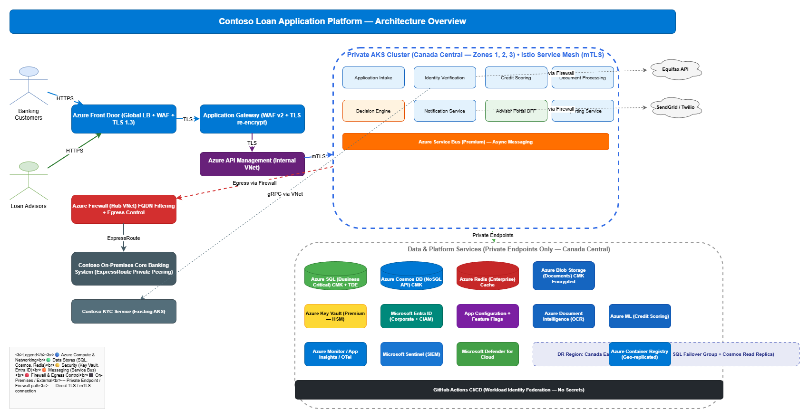

# Architecture Design: Contoso Loan Application Platform

## Requirements Summary

Contoso Financial Services requires a **digital loan application platform** enabling retail banking customers to apply for personal loans, auto loans, and mortgage pre-approvals via web and mobile channels. The platform must handle up to 10,000 concurrent users at 99.95% availability, process **Confidential** data (PII + financial), and comply with PIPEDA, OSFI, and AML regulations. All customer data must reside in Canadian Azure regions (Canada Central / Canada East). The solution integrates with Equifax (external credit checks), Contoso Core Banking (on-premises via ExpressRoute), an existing KYC service on AKS, and Azure AI services for document intelligence and ML-based credit scoring.

**Key Constraints:**
- Team expertise: .NET and React (strong); Java (limited)
- Budget: ~$15K/month Azure production spend
- Timeline: MVP in 4 months, GA in 6 months
- Must integrate with Contoso Azure Landing Zone
- RPO ≤ 30 min, RTO ≤ 2 hours (exceeds Contoso standard baseline)

## Architecture Overview



The Loan Application Platform follows a **microservices architecture** deployed on **Azure Kubernetes Service (AKS)** in a private cluster configuration within the Contoso Azure Landing Zone. Services are decomposed using Domain-Driven Design (DDD) bounded contexts.

### Microservice Decomposition

| Service | Bounded Context | Responsibility |
|---------|----------------|----------------|
| **Application Intake Service** | Loan Application | Receives and validates loan applications from customers |
| **Identity Verification Service** | KYC/AML | Orchestrates Equifax and internal KYC verification |
| **Credit Scoring Service** | Underwriting | Invokes ML model for automated scoring; routes to manual queue |
| **Document Processing Service** | Document Management | Manages upload, OCR extraction via Azure Document Intelligence |
| **Decision Engine Service** | Underwriting | Rules-based + ML-assisted loan decisioning |
| **Notification Service** | Communications | Sends email/SMS status updates via SendGrid/Twilio |
| **Advisor Portal BFF** | Advisor Experience | Backend-for-Frontend for the internal advisor web app |
| **Reporting Service** | Analytics | Aggregates data for dashboards and SLA tracking |

### High-Level Component Layout

```
                                    ┌─────────────────────────────────┐
                                    │       Azure Front Door          │
                                    │   (Global LB + WAF + TLS)      │
                                    └──────────┬──────────────────────┘
                                               │
                                    ┌──────────▼──────────────────────┐
                                    │    Azure API Management (APIM)  │
                                    │   (Rate Limiting, Auth, Routing)│
                                    └──────────┬──────────────────────┘
                                               │
                         ┌─────────────────────┼─────────────────────┐
                         │              Private AKS Cluster          │
                         │  ┌─────────┐ ┌──────────┐ ┌───────────┐  │
                         │  │ App     │ │ Credit   │ │ Decision  │  │
                         │  │ Intake  │ │ Scoring  │ │ Engine    │  │
                         │  └────┬────┘ └─────┬────┘ └─────┬─────┘  │
                         │       │            │            │         │
                         │  ┌────┴────┐ ┌─────┴────┐ ┌────┴──────┐ │
                         │  │ ID      │ │ Document │ │ Notifica- │ │
                         │  │ Verify  │ │ Process  │ │ tion Svc  │ │
                         │  └─────────┘ └──────────┘ └───────────┘ │
                         │  ┌─────────┐ ┌──────────┐               │
                         │  │ Advisor │ │Reporting │               │
                         │  │ BFF     │ │ Service  │               │
                         │  └─────────┘ └──────────┘               │
                         └──────────────────┬────────────────────────┘
                                            │
            ┌───────────────┬───────────────┼───────────────┬──────────────┐
            │               │               │               │              │
    ┌───────▼─────┐ ┌───────▼─────┐ ┌───────▼─────┐ ┌──────▼──────┐ ┌────▼────┐
    │ Azure SQL   │ │ Cosmos DB   │ │ Service Bus │ │ Redis Cache │ │Key Vault│
    │ (Primary DB)│ │ (Documents) │ │ (Messaging) │ │ (Sessions)  │ │(Secrets)│
    └─────────────┘ └─────────────┘ └─────────────┘ └─────────────┘ └─────────┘
```

### Traffic Flow

1. **Customer traffic** enters via Azure Front Door (TLS 1.3, WAF OWASP 3.2) → APIM (authentication, rate limiting) → AKS ingress controller → microservices
2. **Advisor traffic** follows the same path but authenticated via Entra ID with MFA (employee Conditional Access policies)
3. **Customer identity** managed via Entra External ID (CIAM) with risk-based MFA for sensitive operations
4. **Inter-service communication** uses gRPC with mTLS via Istio service mesh within the AKS cluster
5. **Asynchronous workflows** (credit scoring, document processing, notifications) flow through Azure Service Bus queues/topics
6. **On-premises integration** to Core Banking via ExpressRoute private peering through the hub VNet
7. **External API calls** (Equifax, SendGrid, Twilio) route through Azure Firewall with FQDN filtering

### Technology Stack Summary

| Layer | Technology | Justification |
|-------|-----------|---------------|
| Frontend (Customer) | React 18+ / Next.js 14+ | Team expertise; approved [CTSO-APP-001 §3] |
| Frontend (Advisor) | React 18+ | Team expertise; approved [CTSO-APP-001 §3] |
| Backend Services | .NET 8+ (C#) | Team strength; approved [CTSO-APP-001 §3] |
| API Gateway | Azure API Management | Required [CTSO-APP-001 §1] |
| Compute | AKS (private cluster) | Preferred platform [CTSO-INFRA-001 §3] |
| Service Mesh | Istio | Approved for mTLS [CTSO-APP-001 §3] |
| Primary Database | Azure SQL Database | .NET alignment [CTSO-DATA-001 §1] |
| Document Store | Azure Cosmos DB (NoSQL) | Schema-flexible document storage [CTSO-DATA-001 §1] |
| Cache | Azure Cache for Redis (Enterprise) | Session/result caching [CTSO-DATA-001 §1] |
| Messaging | Azure Service Bus (Premium) | Async workflows [CTSO-APP-001 §1] |
| OCR/AI | Azure Document Intelligence | Document processing requirement |
| ML Scoring | Azure Machine Learning | Credit scoring models |
| IaC | Bicep | Preferred IaC tool [CTSO-INFRA-001 §4] |
| CI/CD | GitHub Actions | Pipeline automation [CTSO-APP-001 §6] |
| Observability | OpenTelemetry → Application Insights | Required [CTSO-APP-001 §5] |
